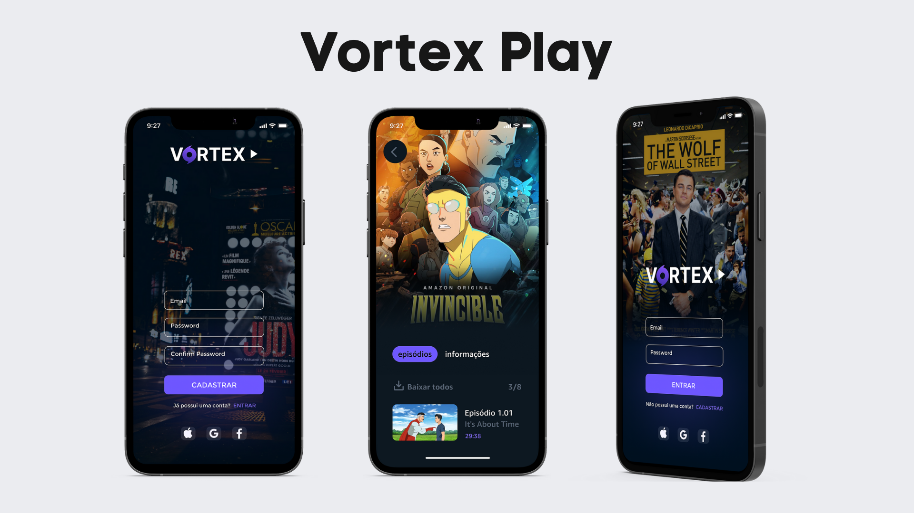

# Vortex Play

<p align="center">
    
</p>
    


## :rocket: Tecnology

-  Dart
-  Flutter

## 💻 About the Project

Amazon interface redesigned and developed with Flutter, with the aim of studying and training skills for FrontEnd development.
The project was inspired by the following design.

## Inspiration:

-  https://www.primevideo.com/
-  https://www.netflix.com/


### Functionalities

- [x] **Carousel listing**: Presents Scrool animation for product sections.

- [x] **Shopping cart Page**: Opens a cart page where all products for purchase are located.


## :computer_mouse: Installation and execution

Make a clone of this repository and access the directory.

```bash
$ git clone git@github.com:afonsoburginski/vortex.git && cd vortex
```


Install the dependencies

```Dart
# Install
$ flutter pub get

# Running the Doctor
$ flutter doctor

# Start the App
$ Flutter Run
```

## :space_invader: Contribute

Go to `fork` and clone the project from your user.

```bash
# Cloning project
$ git clone https://github.com/YOUR-USERNAME/vortex.git

# Create a branch
$ git branch my-change

# Accessing the new branch
$ git checkout -b my-alteration

# Adding the changed files
$ git add

# Create commit and the message
$ git commit -m "Fixing...."

# Sending changes to the brach
$ git push origin my-change
```
You should navigate to your repository where you have forked and click the *New pull request* button on the left side of the page.

## :alien: Autor
-  [Github](https://github.com/Kyuorhan/)
-  [Linkedin](https://www.linkedin.com/in/jhonny-kyuorhan/)
-  [Email](mailto:jkprogrammer96@gmail.com/)

## 📝 Licença

This project is under the MIT license. See the file [LICENSE](LICENSE.md) for more details.
